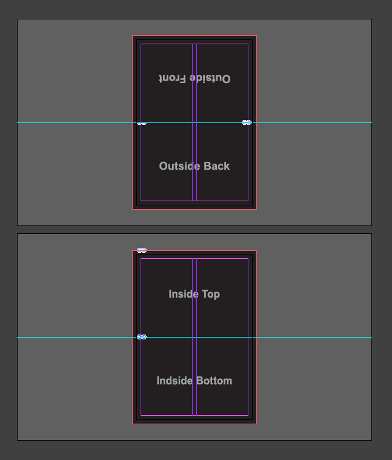

# 7x10-card-template

**7" x 10" opened, 7" x 5" folded; Illustrator + Indesign template files.**

Illustrator artboard layout:

Indesign pages:

Used to create [a card like this](https://www.behance.net/gallery/27441523/Open-House-Invitation).

---

#### LEGAL

Copyright © 2015 [Micky Hulse](http://mky.io).

Licensed under the Apache License, Version 2.0 (the “License”); you may not use this work except in compliance with the License. You may obtain a copy of the License in the LICENSE file, or at:

[http://www.apache.org/licenses/LICENSE-2.0](http://www.apache.org/licenses/LICENSE-2.0)

Unless required by applicable law or agreed to in writing, software distributed under the License is distributed on an “AS IS” BASIS, WITHOUT WARRANTIES OR CONDITIONS OF ANY KIND, either express or implied. See the License for the specific language governing permissions and limitations under the License.

