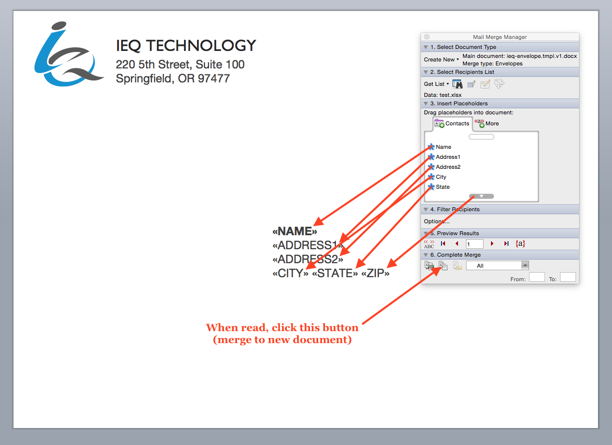
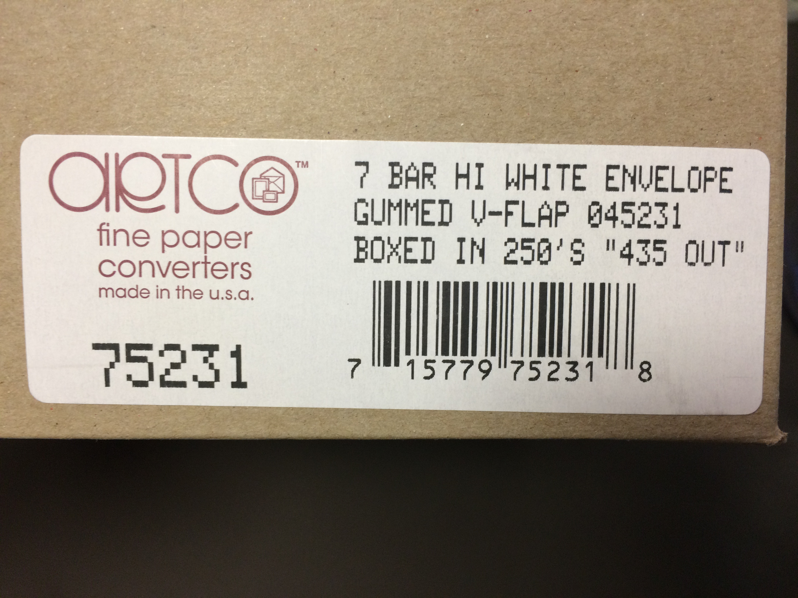

# A7 envelope

**Use these files to print A7 envelopes from your inkjet using MS Word.**

## Post office

* As far as the US(PS) mail system is concerned, you can put as much branding as you want on the back side of the envelope.
* On the front side, you must reserve 4" of blank white space for official post office business; the rest of the document can have your branding.
* USPS has specific requirements for [address formatting](http://pe.usps.com/businessmail101/addressing/deliveryAddress.htm).

## Mail merge settings

Use `test.xlsx` for testing addresses with mail merge.

## Insertion into printer

Before:

… and after:

## Printer settings

## MS Word graphics

If vector file, use "EMF" format; otherwise, use PNG.

## What next?

Buy 7.25" x 5.25" envelopes. Here’s a brand I bought ([from here](https://www.google.com/maps/@44.0489824,-123.1479376,3a,75y,254.53h,82.47t/data=!3m6!1e1!3m4!1sDI780UAQiuKJTp5MYXfdLA!2e0!7i13312!8i6656!6m1!1e1)) the last time I made cards:

Or, only slightly more expensive:

